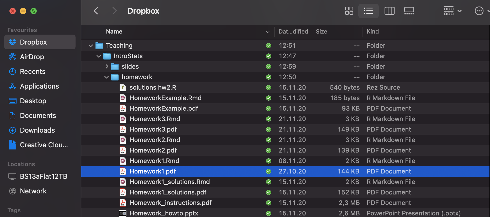
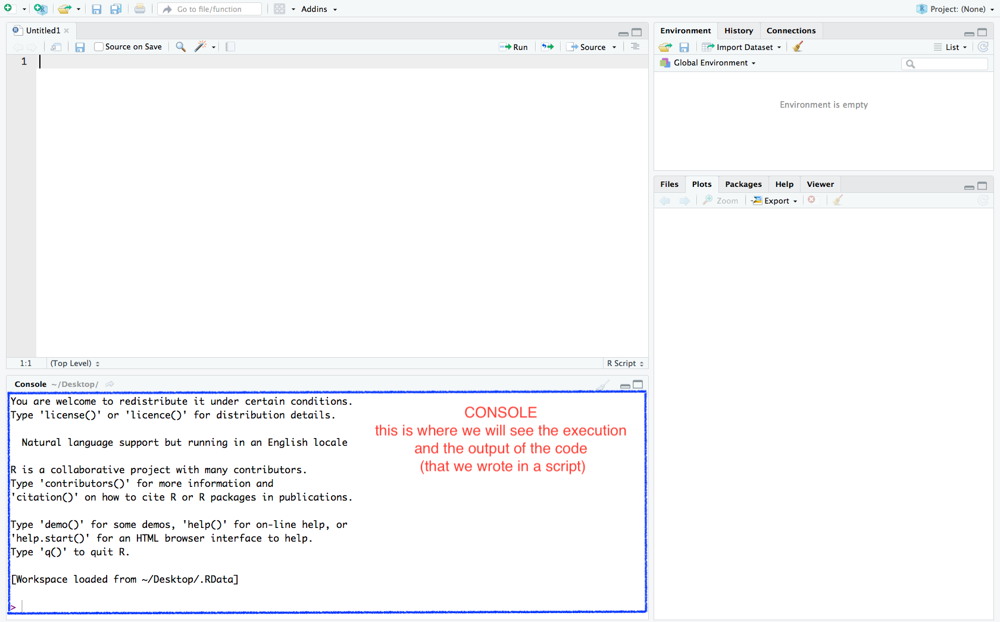
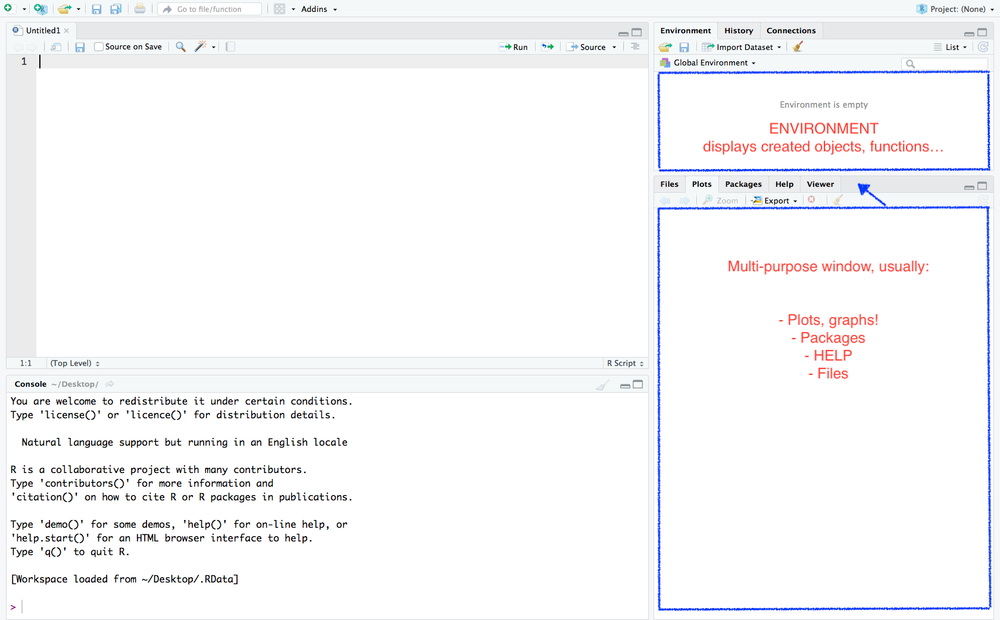
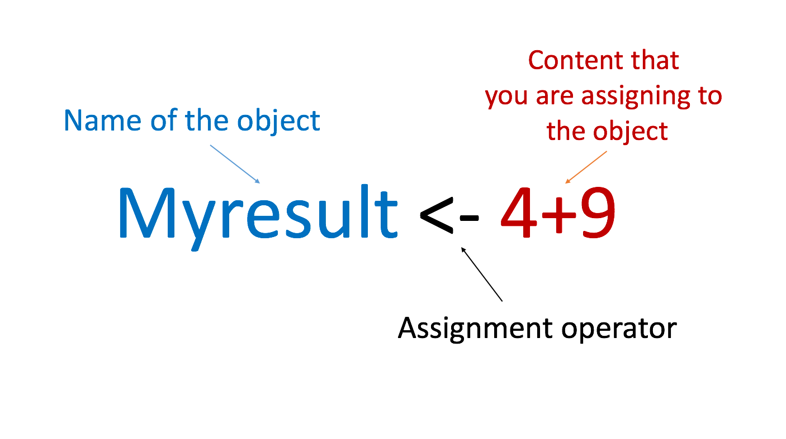
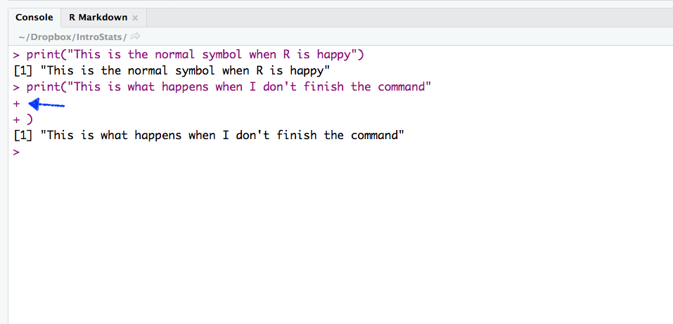

Introduction to R (part I)
========================================================
author: Paula Lissón and Shravan Vasishth
date: October 2024
<!-- initial date OCT 2018 -->
<small> 
Universität Potsdam   
Deparment of Linguistics
</small>

Contact : Forum on moodle: 

https://moodle2.uni-potsdam.de/course/view.php?id=43372


About these slides
========================================================

These slides will introduce you to the basics of R and to the main R functionalities you need to know in order to do this course.

This tutorial is designed for complete beginners.  

Intro: what is R?
========================================================

R is a free and powerful programming language, widely used
in academia and industry. Learning R has many advantages, for example:
- Statistical analysis for your research 
- Visualisation of data 
- In Linguistics, R also opens a new world of possibilities (text and speech analysis, computational semantics/pragmatics/psycholinguistics...)
- Also, once you learn one programming language it is easier to learn another one

What will you learn?
========================================================
- You will explore the basics of R and RStudio
- Basic types of objects (vectors, matrices...)
- Some R functions and operations
- What packages are and how to install them 
- File paths, import and export data to/from R
- Some important warnings for beginners 
- Some more R constructs and functions you will need for this course (ifelse, for loops; histograms...)


Files and folders
========================================================
How are files organised on a computer?

1. Every user has a **home** folder: 
 + C:\Users\paula on Windows
 + /Users/paula on a Mac
 
2. All user files and folders are within the **home** folder:
 + /Users/paula/Dropbox
 + /Users/paula/Downloads
 + /Users/paula/Desktop

Files and paths
========================================================
Folders within folders make a "file tree". A file can be located using its **path**:

 + /Users/paula/Dropbox/teaching
 + /Users/paula/Dropbox/teaching/IntroStats
 + /Users/paula/Dropbox/teaching/IntroStats/Homework1.pdf

This is how it looks: 
========================================================
/Users/paula/Dropbox/teaching/IntroStats/Homework1.pdf




On the command line (Mac or Linux): 
========================================================
      (base) shravanvasishth@Shravans-MBP-9 LM % tree
      .
      ├── LMSummarySheet.Rnw
      ├── LMSummarySheet.pdf
      ├── LinearModelingLectureNotes2016.R
      ├── LinearModelingLectureNotes2018.Rnw
      ├── LinearModelingLectureNotes2018.pdf
      ├── README.md
      ├── datacode
      │   ├── BHHshoes.txt
      │   ├── beauty.txt
      │   ├── beetle.txt
      │   ├── hindi10.txt
      └── logistic_fake.R
      

A piece of advice
========================================================
You should gather all the materials from this course in the same folder. Create a new folder, give it a useful name, and make sure that all the homework assignments, notes, code, etc., are located within that folder. 

Careful with file names ! 
========================================================
* Try to avoid spaces when naming a folder/file, because computers can get confused with spaces. 
 + **Good names for folders:** stats1, Statistics1, Stats_2024, 
 (notice that capitalization matters!)
 + Names I don't like for folders: Stats 1, stats 1, statistics 2024
 
* Also try to avoid special characters when naming files/folders, such as accents, umlauts... these can sometimes cause problems. Just use ASCII characters.


So, let's get started with R!
========================================================

- I assume you have downloaded R and RStudio
- If you haven't pause the video and do it now


1. RStudio
========================================================


========================================================


========================================================



Before we start: 
========================================================

- You should write your code in the *SCRIPT* window (not the command line)
- You run the code in your script with the shortcut **command + enter** (MAC) or **control + enter** (Windows), or by clicking the **"Run"** icon in the upper right corner of the script pannel 
- The output generated by the code will appear in the Console
- Scripts are conventionally saved as files with the extension .R
- Do not save R code in Word files

Working directory
========================================================
Always check what your **working directory** is! 
Remember what we said about files being organized in folders? When you open R, you need to make sure that R is working on the same folder where your data/code is located. So, if you created a new folder for this course, e.g., **Stats1**, you want to tell R that your working directory has to be Stats1. How do we do this? 

1. Check what current working directory in R by typing **getwd()** in the console. For most of you, the default working directory is the users folder, i.e.: 
/Users/paula

2. Change your working directory: In Rstudio, go to **Session**, then **Set working directory** and choose the folder where you want to work. 

Why is this important?
========================================================
We will work with data. The working directory in R needs to be the folder in which your data are located. Otherwise, R will NOT find your data. 


Some advice on formatting in R scripts
========================================================
The **#** symbol in R is the indicator of a comment. That means that in your code, any line starting with # will be ignored by R (in RStudio the line will be of a different color, green in the default configuration):
- Use the # to comment your code as much as possible, you should keep track of everything you do 
- Comments can also be reminders for yourself, i.e.: "TODO: revise this line of code", "Ask about this error", "repeat this tomorrow". Remember, R will automatically ignore any code written on a line that starts with #

Some advice on formatting
========================================================
You can organize your script with headers so that you have a clear outline (and trust me, when the script is long, this is very useful). These are some possibilities:

``` r
# 1. Intro to R ----------
# 2. Second class: intro to R part 2 --------
# 3. Normal distribution --------- 

#################### This is a header --
#-------- This is also a header -------
```

How to create an object in R
========================================================


Let's go!
========================================================
incremental: true

The first thing that you need to know is how to create and object.
Type the following examples (in your script), run the code (cmnd/cntrl + enter) 
and observe the difference (in your console):


``` r
#example1 
myresult <- 4+5 
#example2 
3 + 3 
```

```
[1] 6
```

Why is there only one result displayed in the console? 

========================================================
incremental: true

Check the right upper panel (environment) and you will see
that R has saved "myresult". You created an object with the
operator "<-". Now observe what happens in the console when
you type the name of the new object you've created.


``` r
myresult
```

```
[1] 9
```


========================================================
incremental: true

The object *myresult* is a variable, it contains the value you
have assigned to it (i.e. the result of 4+5). Look what happens
when we perform operations with the object:


``` r
myresult - 3
```

```
[1] 6
```

``` r
myresult
```

```
[1] 9
```
but why does *myresult* remain the same than before (9)
if we just subtracted -3 from it? 

========================================================
incremental: true

The reason is that the only way to modify that object 
is to reassign a new value to it (again, with the "<-" operator).

Take a minute to think about this: How would you create
a new object (call it myresult2) that contains the value of "myresult - 3"?


``` r
myresult2 <- myresult - 3 # this way you do not overwrite the previous object "myresult", you create a new one instead with a different (meaningful) name
myresult2
```

```
[1] 6
```

========================================================
incremental: true
You can also perform operations with objects directly, such as:

``` r
myresult2 * myresult # equivalent to 6 * 9
```

```
[1] 54
```

``` r
myresult / myresult2 # equivalent to 9/6
```

```
[1] 1.5
```

``` r
myresult2^2 # equivalent to 6^2
```

```
[1] 36
```

``` r
sqrt(myresult) # equivalent to sqrt(9)
```

```
[1] 3
```


Objects
========================================================
incremental: true
If we overwrite the content of an object, its
content will change and its value won't be the initial one anymore, i.e.:

``` r
myobject <- 3*2
myobject
```

```
[1] 6
```

``` r
(myobject <- 400)
```

```
[1] 400
```

========================================================
Notice that the assign operator is always "<-" and NOT -> . Notice also that objects can contain numbers, but also strings:

``` r
myobject <- "This is my object"
myobject
```

```
[1] "This is my object"
```

Strings always have to be enclosed by " " or ' '. 

+ prompt
========================================================
- Sometimes (see image) the console in R displays a **+** sign instead of the usual command line prompt **>**
- The **+** means that, due to a syntax error, R thinks that you aren't done and expects more input from you. 
- You can either write whatever is missing or press the **esc** key:




A comment on errors.
========================================================

- Getting R errors will happen very often. **DON'T BE DISCOURAGED**
- When something is wrong, the console will display a message (sometimes in red). READ THE MESSAGE. 
- With simple errors, if you copy and paste the error in google, you will usually get an answer. 
- But you should always try to interpret it yourself first

Example. Run the following code (without the #). When do you get an error, and why? 

``` r
myvariable <- 1
myvariable2 <- apple 
myvariable3 <- "apple"
```


Exercise
========================================================
incremental: true

- Add 85 to 156
- Subtract 200 from the result
- Multiply the result by 3
- Raise the result to the power of 2
- What is the final result of all these operations? 


``` r
((((85+156)-200)*3)^2)
```

```
[1] 15129
```

Naming objects
========================================================
- Use meaningful names that describe the content of the object 
- Don't use extermely long names (very impractical)
- Spaces are forbidden. E.g, use "means_group_3" or "MeansGroup3" instead of "Means Group 3"
- Objects starting with a number or other symbols rather than letters (i.e., !myobject, 4_test) are also forbidden.

========================================================
- Capitalization matters, see:

``` r
MY_object <- 45
MY_object
```

```
[1] 45
```
But if we type "my_object" instead of "MY_object" we get an error that looks like this:

``` r
#Error in eval(expr, envir, enclos) : object 'my_object' not found
```

- Don't hesitate to check your environment (right upper panel) to see the objects you've created

Data types and R objects
========================================================
We will only focus on atomic vectors and data frames, but
it will be useful to recognise other object types (there
are more than the ones presented here):

1. Objects that can only store a single type of data (atomic vectors)
can be of type:
 - **Numerical**
 - **Character / strings (text)**
 - **Logical (True/False)**
 - **Factors** 

========================================================
2. These also store only one data type, but can have more than 1 dimension:
 - **Matrices (two dimensions)** 
 - **Arrays (2 or more dimensions)** <- no need to worry about this for now 
 
3. These can store more than one data type (i.e. numbers as numerical and strings as character):
 - **Lists** <- no need to worry about this for now 
 - **Data frames** This data type will play a central role in the course 


Useful functions for any data type and any object:
========================================================

``` r
class(nameoftheobject)
length(nameoftheobject)
```


``` r
string <- "hello"
class(string)
```

```
[1] "character"
```

``` r
length(string)
```

```
[1] 1
```


Data types and R objects: part I
========================================================
Today we will focus on:

1. Objects that can only store a single type of data (atomic vectors)
can be of type:
 - **Numerical**
 - **Character / strings (text)**
 - ~~Logical (True/False)~~
 - ~~Factors~~

 
Numerical vectors
========================================================
incremental: true

Examples

``` r
myvector1 <- 1:10
myvector1
```

```
 [1]  1  2  3  4  5  6  7  8  9 10
```

``` r
myvector2 <- c(1, 2, 3)
myvector2
```

```
[1] 1 2 3
```

The **c** is for "concatenate".


======================================================
incremental: true


``` r
myvector3 <- seq(from = 1, to = 10, by = 0.5)
myvector3
```

```
 [1]  1.0  1.5  2.0  2.5  3.0  3.5  4.0  4.5  5.0  5.5  6.0  6.5  7.0  7.5  8.0
[16]  8.5  9.0  9.5 10.0
```

``` r
(myvector4 <- seq(1,10,0.5)) # same than in previous but shorter
```

```
 [1]  1.0  1.5  2.0  2.5  3.0  3.5  4.0  4.5  5.0  5.5  6.0  6.5  7.0  7.5  8.0
[16]  8.5  9.0  9.5 10.0
```

* Notice the use of parenthesis at the beginning and end of myvector4: if we enclose everything in parenthesis, R will automatically display the output even if it is in an object 

Character vectors
======================================================
incremental: true

Examples

``` r
strings <- c("this","is","my","text")
class(strings)
```

```
[1] "character"
```

``` r
length(strings)
```

```
[1] 4
```

``` r
nchar(strings)
```

```
[1] 4 2 2 4
```

======================================================
incremental: true

Note that we can explicitly tell R to change the data type:

``` r
myvector <- 1:10
class(myvector)
```

```
[1] "integer"
```

``` r
as.character(myvector)
```

```
 [1] "1"  "2"  "3"  "4"  "5"  "6"  "7"  "8"  "9"  "10"
```

``` r
as.numeric("1") # remember that everything enclosed in "" is normally character
```

```
[1] 1
```


Subsetting and more operations with vectors
========================================================
incremental: true

* To get a particular element (or sequences of elements) in a vector, we use square brackets []


``` r
myvector <- 10:1
myvector[3] # we are asking for the third element of the vector, i.e. 8 
```

```
[1] 8
```

``` r
myvector[3:6]
```

```
[1] 8 7 6 5
```

========================================================
incremental: true
* Guess what the following code will output:

``` r
myvector <- 10:1
myvector[c(1,3,5)]
```

```
[1] 10  8  6
```

* and this?

``` r
x <- 1:20
x
```

```
 [1]  1  2  3  4  5  6  7  8  9 10 11 12 13 14 15 16 17 18 19 20
```

========================================================
incremental: true
What will the following code output?

``` r
x[-(2:4)]
```

```
 [1]  1  5  6  7  8  9 10 11 12 13 14 15 16 17 18 19 20
```
And this one? (the **c** is for "concatenate")

``` r
x[c(1, 5)]
```

```
[1] 1 5
```

========================================================
incremental: true
What about this one?

``` r
rep(1:4, times=3)
```

```
 [1] 1 2 3 4 1 2 3 4 1 2 3 4
```

And this one?

``` r
rep(1:2, each=3)
```

```
[1] 1 1 1 2 2 2
```


========================================================
incremental: true

* When we multiply/divide/sum/subtract/raise a vector by a number, every member of the vector is subjected to the operation:

``` r
myvector <- 1:10
(result <- myvector * 2)
```

```
 [1]  2  4  6  8 10 12 14 16 18 20
```
* when we multiply/divide/sum/subtract/raise a vector by another vector, observe what happens:

``` r
x <- c(1,3)
y <- c(2,4)
x*y
```

```
[1]  2 12
```


Functions
========================================================
incremental: true
Functions are pieces of code that do something specific, with or without parameters. In (base) R, there are many built-in functions, this means that you don't have to create them; you can simply use them. Some useful functions are: 

``` r
rm(myobject) # erases the object
sqrt(5) # square root
```

```
[1] 2.236068
```

``` r
rep(1,7) # notice the two arguments here (because the order matters!); this means "repeat seven times the number one"
```

```
[1] 1 1 1 1 1 1 1
```


========================================================
incremental: true
As we have seen, the c() function concatenates its arguments, for example:

``` r
fruits <- c("orange","banana","apple")
fruits
```

```
[1] "orange" "banana" "apple" 
```

``` r
values_group1 <- c(23,32,45,56,33,43)
```

========================================================
incremental: true
We can compute the mean and the standard deviation with the functions **mean()** and **sd()**:


``` r
mean(values_group1)
```

```
[1] 38.66667
```

``` r
sd(values_group1)
```

```
[1] 11.67333
```
You can nest functions within others, so for example, what do you think the following code will do?

``` r
round(mean(values_group1))
```

```
[1] 39
```

========================================================

``` r
round(mean(values_group1),1)
```

```
[1] 38.7
```


``` r
round(mean(values_group1),2)
```

```
[1] 38.67
```

Min and max values:

``` r
min(values_group1)
```

```
[1] 23
```

``` r
max(values_group1)
```

```
[1] 56
```


========================================================
incremental: true

The function summary() calculates basic summary statistics:

``` r
summary(values_group1)
```

```
   Min. 1st Qu.  Median    Mean 3rd Qu.    Max. 
  23.00   32.25   38.00   38.67   44.50   56.00 
```

========================================================
incremental: true

``` r
(logvalues<- log(values_group1))
```

```
[1] 3.135494 3.465736 3.806662 4.025352 3.496508 3.761200
```

``` r
exp(logvalues)
```

```
[1] 23 32 45 56 33 43
```

Help
========================================================
R has a help function, which consists on typing a **?** before the function you want to know more about. You can also do this with the function **help()**.

Type the following code and observe what happens in the lower panel to the right:

``` r
?rnorm #equivalent to help(rnorm)
```

You should get now the description of the funtion, its usage, arguments, some details, examples and references. If you can't get what you wanted, try **??** (i.e. > ??rnorm).


Packages
========================================================
- Packages are essentially collections of functions that are not implemented in base R
- Once you have downloaded and loaded the package, you can use all the functions of the package. 
- All the "official" packages are stored in **CRAN** (Comprehensive R Archive Network), and there are thousands of them. Have a look at: https://cran.r-project.org/web/views/NaturalLanguageProcessing.html

- R is open source, and free: anyone can contribute with their own code/package. 


Downloading and loading packages
========================================================
- You only need to download a package once 
- But every time you open Rstudio, you need to load it, otherwise it won't work


``` r
install.packages("stats") # ONLY ONCE
library(stats) # every time you open a session
```

**NOW**: download the **knitr** package (we will need it for the homework)

``` r
install.packages("knitr")
install.packages("tinytex")
```


<!-- Plotting: Histograms -->
<!-- ======================================================== -->
<!-- R has several built-in datasets (for practice/didactics purposes). We will use the dataset **iris** to produce simple graphs. First, load the dataset by doing **data(iris)**, and see how it looks like by using the function summary() and/or head(). -->
<!-- ```{r, eval=FALSE, echo=TRUE} -->
<!-- summary(iris) -->
<!-- head(iris) -->
<!-- ``` -->

<!-- Plotting: Histograms -->
<!-- ======================================================== -->
<!-- * A histogram is simply a way to graphically explore the distribution of a numerical variable -->

<!-- ```{r} -->
<!-- hist(iris$Petal.Length,freq=F) -->
<!-- ``` -->


<!-- Plotting: Histograms -->
<!-- ======================================================== -->
<!-- ```{r} -->
<!-- hist(iris$Petal.Length,breaks=30) -->
<!-- ``` -->


<!-- ======================================================== -->
<!-- ```{r} -->
<!-- hist(iris$Petal.Length,breaks=50) -->
<!-- ``` -->


<!-- Plotting: Scatter plots  -->
<!-- ======================================================== -->
<!-- incremental: true -->

<!-- An way to observe the relationship between two numeric variables: -->
<!-- ```{r} -->
<!-- plot(iris$Petal.Length, iris$Petal.Width) -->
<!-- ``` -->

<!-- ======================================================== -->
<!-- incremental: true -->

<!-- Given the scatter plot in the previous slide, what can we observe about the relationship between Petal Lenght and Petal Width? -->
<!-- * This can be also checked numerically: -->
<!-- ```{r} -->
<!-- cor(iris$Petal.Length, iris$Petal.Width) -->
<!-- ``` -->


<!-- Just for fun: have a look at some of the plots you can do with R  -->
<!-- ======================================================== -->

<!-- https://www.r-graph-gallery.com/histogram/ -->

<!-- http://www.r-graph-gallery.com/21-distribution-plot-using-ggplot2 -->

<!-- https://www.r-graph-gallery.com/129-use-a-loop-to-add-trace-with-plotly/ -->

<!-- General guidelines -->
<!-- ======================================================== -->
<!-- - **NEVER NEVER NEVER** use Word, LibreOffice, or PPT to write code. If you don't like Rstudio, you could use a text editor such as Atom, Aquamacs, or even the text editor by default in your computer. BUT DON'T USE WORD. -->
<!-- - Try to comment your code as you are doing it, it will be useful for you in the future -->
<!-- - If you consult online sites and copy and paste the code, always put in a comment (#) the reference to the original source -->

<!-- ======================================================== -->
<!-- - Don't get stressed out or mad at R. Learning a programming language takes time, effort, and a lot of mistakes. All of that is normal. Take a breath and a break if you start to get angry or feel that you cannot deal with R -->
<!-- - Don't be afraid of asking questions, either online, to your classmates, or to me -->


Note
========================================================
Often, there are many many ways of obtaining the same result with R. That is, there are many possible alternative functions to get to the same goal. The functions I am showing you here are very basic and by no means the only way to get to the results. If you find other possibilities when consulting forums online or in reference books, that's fine. I don't want you to get overwhelmed, so I'm just showing you one way to do things, but if you want to learn more ways, that's perfect. 

Online resources
========================================================
incremental: true
R has a huge and generally quite friendly community. Some online useful 
resources are:

- Stackoverflow (you will find most answers in this site when you google errors)
- RStudio.com/resources
- RGraph gallery 
- Twitter/X! (check #rstats #rladies #rstudio)
- R meetups in general, and Rladies:
  - https://www.meetup.com/de-DE/rladies-berlin/
  - https://www.meetup.com/de-DE/berlin-r-users-group/
- Learning Statistics with R: a tutorial for psychology students and other beginners, by Danielle Navarro: https://learningstatisticswithr.com/

Homework
========================================================
Homework is available in Moodle. We will use RMarkdown.

There's a pdf in Moodle that contains the exercises. 

You have to open a new RMarkdown file, complete the exercises. Once you are done, knit the file to PDF and upload it to moodle. Please, name the file with your own last name in the following format: LissonHW1 for homework 1 and LissonHW2 for homework 2.
