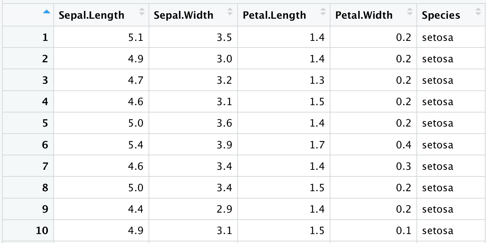
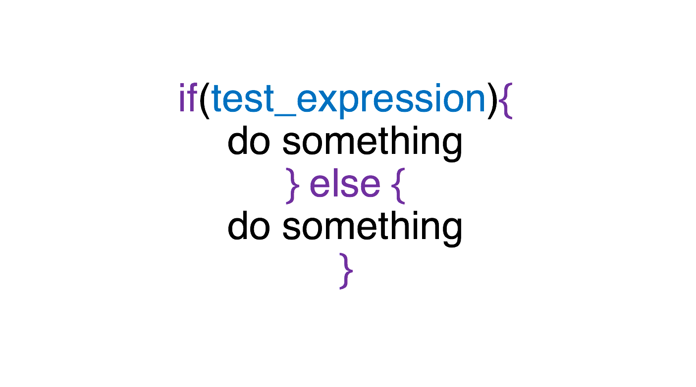
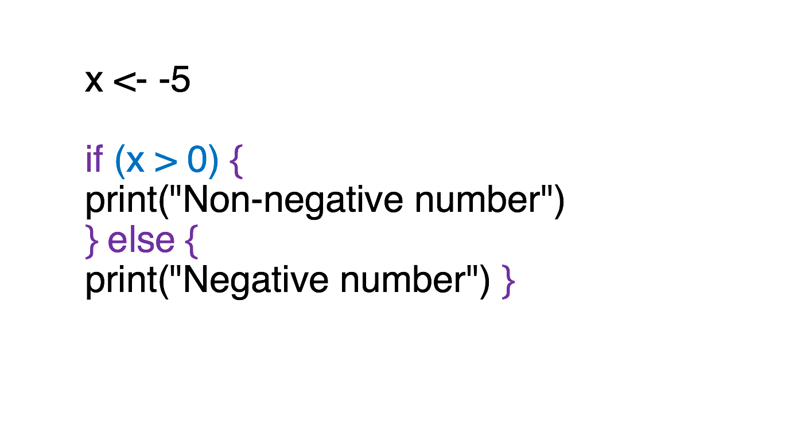
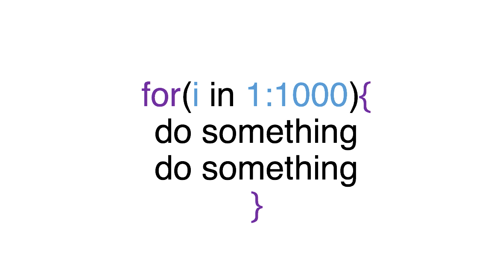

Introduction to R (part II)
========================================================
author: Paula Lissón and Shravan Vasishth 
date: October 2024
autosize: true

<small> 
Universität Potsdam   
Department of Linguistics
</small>

Contact : vasishth.shravan@gmail.com 


Today we will talk about:
========================================================
- Matrices 
- Data frames 
- Factors
- Logical (Boolean) values and logical operations
- if and ifelse statements
- for loops
- User-defined functions
- Importing and exporting tabular data
- Plotting, histograms, scatter plots

Matrices
========================================================
incremental:true

Matrices are like vectors (they only support one type of data) but they have two dimensions: rows and columns.


``` r
my_matrix <- matrix(nrow = 4, ncol = 4) 
# notice that my_matrix is empty, NA stands for empty values. 
my_matrix
```

```
     [,1] [,2] [,3] [,4]
[1,]   NA   NA   NA   NA
[2,]   NA   NA   NA   NA
[3,]   NA   NA   NA   NA
[4,]   NA   NA   NA   NA
```

``` r
matrix(1:8, ncol = 2)
```

```
     [,1] [,2]
[1,]    1    5
[2,]    2    6
[3,]    3    7
[4,]    4    8
```

Data frame
========================================================
A data frame looks like a matrix (rows and columns) but supports multiple types of data. That is, in a data frame, in different columns you can have numerical values, logical values, strings, and so on.


``` r
data(iris)
class(iris)
```

```
[1] "data.frame"
```

========================================================
This is how the data frame looks like:



Useful functions
========================================================
incremental:true


``` r
names(iris)
```

```
[1] "Sepal.Length" "Sepal.Width"  "Petal.Length" "Petal.Width"  "Species"     
```

``` r
nrow(iris)
```

```
[1] 150
```

``` r
ncol(iris)
```

```
[1] 5
```

========================================================
incremental:true 


``` r
# creating a data frame of two vectors x and y 
x <- 1:10
y <- letters[1:10]
my_data_frame <- data.frame(numbers=x, letters=y)
str(my_data_frame)
```

```
'data.frame':	10 obs. of  2 variables:
 $ numbers: int  1 2 3 4 5 6 7 8 9 10
 $ letters: chr  "a" "b" "c" "d" ...
```

Selecting columns and rows 
========================================================
incremental:true

* The **$** operator selects the column indicated after the operator. 

``` r
petal.length <- iris$Petal.Length
str(petal.length)
```

```
 num [1:150] 1.4 1.4 1.3 1.5 1.4 1.7 1.4 1.5 1.4 1.5 ...
```

* We can also use the **[ ]** to subset a data frame.
Columns are what comes after the comma:

``` r
iris[,1] # returns column 1
iris[,"Sepal.Length"] # also returns column 1 
```

========================================================

``` r
iris[,1:3] #returns columns 1 to 3. 
iris[,c("Sepal.Length","Petal.Length")] # returns columns Sepal.Length and Petal.Length
```

* Rows come before the comma:

``` r
iris[1,] # this is row 1 of dataset iris
```

```
  Sepal.Length Sepal.Width Petal.Length Petal.Width Species
1          5.1         3.5          1.4         0.2  setosa
```

* Question: What will the following code output?

``` r
iris[1,1] 
```

```
[1] 5.1
```

``` r
iris[3,"Petal.Length"]
```

```
[1] 1.3
```

Selecting columns and rows 
========================================================
incremental: true

We can combine the **$** and **[]** operators:


``` r
df$a[df$b==n] #returns all elements of column a for which elements in column b equal n
```

``` r
sepal_length_setosa <- iris$Sepal.Length[iris$Species=="setosa"]
head(sepal_length_setosa)
```

```
[1] 5.1 4.9 4.7 4.6 5.0 5.4
```

Factors
========================================================
incremental: true
Imagine a dataset with reading times of two groups of participants. Within each group, there were both female and male participants. When we do statistical analysis, we need R to consider these labels not as independent strings (words), but as **categories**. Each one of the participants would then have a category for group (1 or 2) and a category for gender (female/male).

This type of data are called **FACTORS** (of two levels for *male, female*, of three levels for *single, married, divorced*, and so on)

Factors
========================================================

``` r
data(iris)
class(iris$Species)
```

```
[1] "factor"
```

========================================================
incremental:true 

FACTORS ARE CRUCIAL in statistical analysis. By default, R may read them them as 'character' rather than 'factor', so you will have to be careful. See:


``` r
mydata <- data.frame(
  animals=c("dog","cat","cat"),
  fruits=factor(c("pear","apple","pear")))
summary(mydata$animals)
```

```
   Length     Class      Mode 
        3 character character 
```

``` r
summary(mydata$fruits)
```

```
apple  pear 
    1     2 
```

========================================================
This is how you can change the class of a column to "factor":
as.factor(dataframe$column)


``` r
mydata$animals <- as.factor(mydata$animals)
class(mydata$animals)
```

```
[1] "factor"
```

``` r
summary(mydata$animals)
```

```
cat dog 
  2   1 
```

========================================================
Sometimes it can be very useful to change the order of the factors in statistical analysis (by default in alphabetical order). See this example:


``` r
table(mydata$animals)
```

```

cat dog 
  2   1 
```

``` r
mydata$animals <- factor(mydata$animals,levels = c("dog","cat"))
table(mydata$animals)
```

```

dog cat 
  1   2 
```

Subsetting
========================================================
incremental: true 


``` r
table(iris$Species)
```

```

    setosa versicolor  virginica 
        50         50         50 
```

``` r
iris_subset <-subset(iris,Species=="setosa")
table(iris_subset$Species)
```

```

    setosa versicolor  virginica 
        50          0          0 
```

``` r
## remove the irrelevant levels:
iris_subset <- droplevels(iris_subset)
table(iris_subset$Species)
```

```

setosa 
    50 
```

========================================================
* Compact way to subset and drop levels:  

``` r
iris_subset <- droplevels(subset(iris, Species=="setosa"))

table(iris_subset$Species)
```

```

setosa 
    50 
```


Logical values (also called Boolean) and logical operators
========================================================

These operators will return **TRUE or FALSE**
- you need to know the most basic **logical operations** cause we will need them for if(else) statements (later on)
  + **<** : Less than; **>** : Greater than      
  + **<=** : Less than or equal to; **>=** : Greater than or equal to 
  + **==** : Test of equality                 
  + **!=** : Not equal to             
  + **x|y**  : x OR y                    
  + **x & y**  : x AND y                  


Logical values and operations
========================================================
incremental:true 

Examples

``` r
a <- 3; b <- 5
a == 3 # Is a equal to 3?
```

```
[1] TRUE
```

``` r
a != b # Is a not equal to b?
```

```
[1] TRUE
```

``` r
b > a # Is b larger than a?
```

```
[1] TRUE
```

Logical values and operations
========================================================
incremental:true 

You can always combine operators, for example: 

``` r
x <- 1:10
# what would these commands yield?
x[(x>2) | (x<4)] 
```

```
 [1]  1  2  3  4  5  6  7  8  9 10
```

Consider them separately:
  

``` r
x[(x>2)]
```

```
[1]  3  4  5  6  7  8  9 10
```

``` r
x[(x<4)]
```

```
[1] 1 2 3
```

========================================================
incremental:true 

Now compare with:

``` r
x <- 1:10
x > 2
```

```
 [1] FALSE FALSE  TRUE  TRUE  TRUE  TRUE  TRUE  TRUE  TRUE  TRUE
```

``` r
x < 4
```

```
 [1]  TRUE  TRUE  TRUE FALSE FALSE FALSE FALSE FALSE FALSE FALSE
```

``` r
x > 2 | x < 4
```

```
 [1] TRUE TRUE TRUE TRUE TRUE TRUE TRUE TRUE TRUE TRUE
```

if statements
========================================================
incremental: true
Statement used when you want something to happen
depending on conditions that you specify:



========================================================

Example :

``` r
x <- -5 
if (x > 0) { 
print("Non-negative number") 
} else { 
print("Negative number") }
```

```
[1] "Negative number"
```


if statements
========================================================



if statements
========================================================
- We can have more conditions with the statement **else if**, just remember the order of statements: 
 - 1) if ..  {
 - 2) } else if {
 - 3) } else {
 - }


``` r
x <- 0
if (x < 0) {
print("Negative number")
  } else if (x > 0) {
print("Positive number")
  } else {
print("Zero") 
  }
```

```
[1] "Zero"
```

========================================================
incremental:true

- what would happen if we change the value of x to 5 and rerun the code?


``` r
x <- 5
if (x < 0) {
print("Negative number")
  } else if (x > 0) {
print("Positive number")
  } else {
print("Zero") 
  }
```

```
[1] "Positive number"
```


ifelse
========================================================
incremental: true

Often, when the if statement is short, we can use the ifelse() command in R. Here is the syntax:

<center>
**ifelse(test_expression, x, y)**
<center>


``` r
(data <- data.frame(condition = rep(c("a","b"),2)))
```

```
  condition
1         a
2         b
3         a
4         b
```

``` r
data$cond <- ifelse(data$condition == "a",1,-1)
data
```

```
  condition cond
1         a    1
2         b   -1
3         a    1
4         b   -1
```


for loops
========================================================
incremental:true

- a **loop** is simply a way to repeat a sequence of instructions 
- for example:


``` r
fruits <- c("banana", "orange", "apple", "peach") 
for (fruit in fruits){
  print(paste("This is a/n", fruit))
}
```

```
[1] "This is a/n banana"
[1] "This is a/n orange"
[1] "This is a/n apple"
[1] "This is a/n peach"
```

for loops
========================================================
incremental:true

- Let's have a closer look. In the first line of code we simply created an object concatenanting the names of the fruits. 
- Then we wrote the for loop. Basically, it means: for each element (fruit) in the object (fruits), print "This is" + the name of each element of the object.
- With a for loop, you can set one or more instructions that will be applied for the range that you have specified (which, in this case, is the content of an object)

``` r
fruits <- c("banana", "orange", "apple", "peach") 
for (fruit in fruits){
  print(paste("This is a/n", fruit))
}
```

for loops
========================================================
incremental:true

Let's take a closer look at the syntax:



Be careful with the number of parentheses and brackets!

for loops
========================================================
incremental:true

Let's have a look at something directly related to the statistics material coming up. This example is taken from the class notes. The idea is to break down the code and understand it here so that you have no problem while working through the notes:

- First, we create an object full of empty values (NA), because it will be filled later on with the values we need. We do that with the function **rep()**, whose first argument is NA (because we want empty values) and the second argument is the number of empty values that we want, i.e. 1000.  

``` r
sample_means <- rep(NA,1000) # check your environment
```

========================================================
incremental:true

- Then, the for loop. 

``` r
for(i in 1:1000){
sample_40 <- rnorm(40,mean=60,sd=4)
sample_means[i] <- mean(sample_40)
}
```
 - For each element/item (i) in the range between 1 and 1000, 
 - sample (from a normal distribution) 40 elements with mean 60 and sd 4 and store them in an object called **sample_40**
 - then store the mean of **sample_40** in a new object called **sample_means**
 

=======================================================
