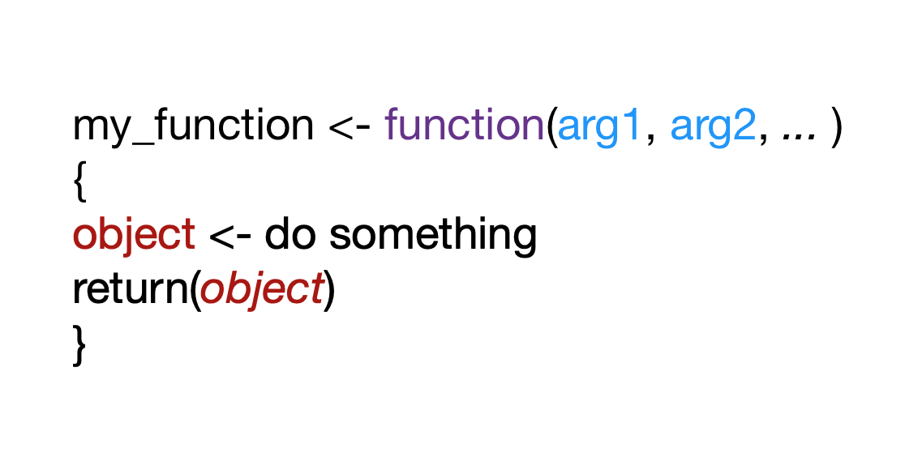
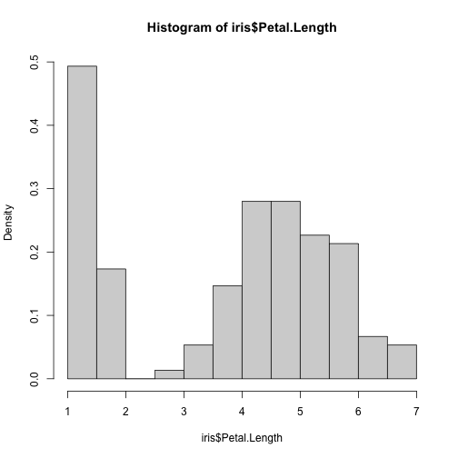
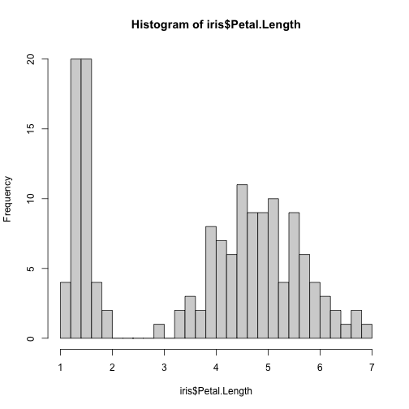
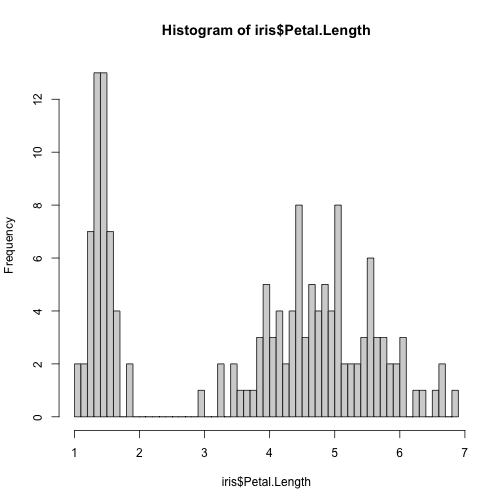
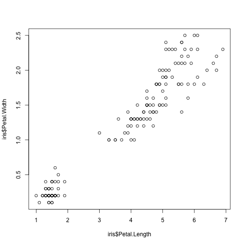

Introduction to R (part III)
========================================================
author: Paula Lissón and Shravan Vasishth
date: November 2024
autosize: true

<small> 
Universität Potsdam   
Department of Linguistics
</small>

Contact : vasishth.shravan@gmail.com 


Today we will talk about:
========================================================

- The functions tapply and xtabs 
- Importing and exporting tabular data
- User-defined functions
- Plotting, histograms, scatter plots

The tapply function
========================================================
incremental: true 
tapply() computes mean, median, min, max,...  values for each factor variable in a vector (or column, in data frames). See:


``` r
data(iris)
tapply(iris$Sepal.Length, iris$Species, mean)
```

```
    setosa versicolor  virginica 
     5.006      5.936      6.588 
```

``` r
tapply(iris$Sepal.Length, iris$Species, sd)
```

```
    setosa versicolor  virginica 
 0.3524897  0.5161711  0.6358796 
```

``` r
tapply(iris$Sepal.Length, iris$Species, length)
```

```
    setosa versicolor  virginica 
        50         50         50 
```


The tapply function
========================================================
Another syntax to achieve the same goal: 


``` r
with(iris, tapply(Sepal.Length, IND=Species, mean))
```

```
    setosa versicolor  virginica 
     5.006      5.936      6.588 
```

Cf:


``` r
tapply(iris$Sepal.Length, iris$Species, mean)
```

```
    setosa versicolor  virginica 
     5.006      5.936      6.588 
```


The xtabs function
========================================================
incremental: true 

This function allows you to create cross-tabulate data, useful for factors. See:

``` r
iris$color <- c(rep("red",50),rep("blue",50), rep("yellow",50))
xtabs(~color+Species,data=iris)
```

```
        Species
color    setosa versicolor virginica
  blue        0         50         0
  red        50          0         0
  yellow      0          0        50
```

Sometimes it's useful to combine it with the transpose function **t()** depending on your preferences, see:


``` r
t(xtabs(~color+Species,data=iris))
```

```
            color
Species      blue red yellow
  setosa        0  50      0
  versicolor   50   0      0
  virginica     0   0     50
```


Importing and exporting tabular data
========================================================
incremental:true

As you have seen, the data frame in R is similar to the classical spreadsheet. We can easily load spreadsheets with our data in R:


``` r
mydata <- read.table("myspreadsheet.txt",header=TRUE)
mydata <- read.table("myspreadsheet.csv",header=TRUE)
mydata <- read.xls("myspreadsheet.xls") ## For Excel files
```

Notice the file format (txt/csv). After the analysis of the data with R, we can export data with:


``` r
write.table(nameofthedataframe, file = "myfile.txt",header=TRUE)
write.csv(nameofthedataframe, file = "myfile.csv")
```

Working directory 
=======================================================
The data file has to be in the proper working directory so that R can access it. R will output the file with the command write.table() to the working directory. Otherwise, we have to specify the path of the files. 

Working directory 
========================================================
You can get your current working directory by using this command: 

``` r
getwd()
```

```
[1] "/Users/shravanvasishth/Library/CloudStorage/Dropbox/Teaching/WI2024-25/Stats1/IntroR2024/slides"
```

You can set up the path to a working directory (careful! not the same for Mac and Windows users): 

``` r
setwd("~/Dropbox/Teaching/IntroR2024")
```

Or, manually in R by clicking on: 

Session \> Working directory \> Choose directory 


User-written (or used-defined) functions
========================================================
incremental:true 




User-written (or used-defined) functions
========================================================
incremental:true

Take, for example, the for-loop that we did before:

``` r
sample_means <- rep(NA,1000)
for(i in 1:1000){
sample_40 <- rnorm(40,mean=60,sd=4)
sample_means[i] <- mean(sample_40)
}
```

We could create a function: 

``` r
sampling_function <- function(Nsamples,N,mean,sd){
  sample_means <- rep(NA,Nsamples) 
  for(i in 1:Nsamples){ 
      sampl <- rnorm(N,mean=mean, 
                      sd=sd)
      sample_means[i] <- mean(sampl)
  }
  return(sample_means)}
```

User-written (or used-defined) functions
========================================================
incremental: true 

We have created our function! Now we can use it. We need to call the function and to fill its arguments. For example:


``` r
myresult <- sampling_function(Nsamples=200,N=20,mean=10,sd=3)
length(myresult)
```

```
[1] 200
```

``` r
## we can also write argument values without naming them 
## (but you will have to respect the order of the arguments in the function):
myresult2 <- sampling_function(100,100,2,5)
length(myresult2)
```

```
[1] 100
```

========================================================
Be careful where you place things! Look at what happens if I define the sample_means vector inside the for loop: 


``` r
sampling_function_wrong <- function(Nsamples,N,mean,sd){
  for(i in 1:Nsamples){
    ## this is wrong:
    sample_means <- rep(NA,Nsamples)
      sampl <- rnorm(N,mean=mean, 
                      sd=sd)
      sample_means[i] <- mean(sampl)
  }
  return(sample_means)
}

myresult_wrong <- sampling_function_wrong(200,N=20,mean=10,sd=3)
head(myresult_wrong)
```

```
[1] NA NA NA NA NA NA
```
Why are all the cells empty?


========================================================
(Nsamples= **200**, N=**20**, mean=10, sd=3)

``` r
sampling_function_wrong <- function(Nsamples,N,mean,sd){
  for(i in 1:Nsamples){ # for i in 1:200
    # rep NA 200 times
    sample_means <- rep(NA,Nsamples) 
    #sample 20 datapoints 
    sample <- rnorm(N,mean=mean, 
                      sd=sd) 
    sample_means[i] <- mean(sample) 
  }
  return(sample_means)
}
```
- The problem is that we included the command "sample_means <- rep(NA,Nsamples)" inside the for loop. So we are not creating a single dataset to store our means, we are creating 200 datasets, one for each iteration of the for loop. 

========================================================
- We are creating one dataset of 200 empty slots 200 times, and in every iteration of the for loop we can only fill one of the empty slots. 
- So what we get at the end is one of these datasets (the last one), that has 1 mean, and 199 empty (NA) slots. 

========================================================
Compare with the original function: 

(Nsamples= **200**, N=**20**, mean=10, sd=3)

``` r
sampling_function <- function(Nsamples,N,mean,sd){
  # create a vector of NA of size 200
  sample_means <- rep(NA,Nsamples) 
  # for each element in 1:200
  for(i in 1:Nsamples){ 
      # sample 20 datapoints
      sample <- rnorm(N,mean=mean, 
                      sd=sd) 
      sample_means[i] <- mean(sample) 
      # take the mean of these 20 datapoints 
      #and store it in my vector of size 200
  }
  return(sample_means)}
  # return my vector of size 200 
  #filled with the means
```

Plotting: Histograms
========================================================
* A histogram is simply a way to graphically explore the distribution of a numerical variable


``` r
hist(iris$Petal.Length,freq=FALSE)
```




Plotting: Histograms
========================================================

``` r
hist(iris$Petal.Length,breaks=30)
```




========================================================

``` r
hist(iris$Petal.Length,breaks=50)
```



Plotting: Scatter plots
========================================================
incremental: true

One way to observe the relationship between two numeric variables:

``` r
plot(iris$Petal.Length, iris$Petal.Width)
```



========================================================
incremental: true

Given the scatter plot in the previous slide, what can we observe about the relationship between Petal Length and Petal Width?
* This can be also checked numerically:

``` r
cor(iris$Petal.Length, iris$Petal.Width)
```

```
[1] 0.9628654
```


=======================================================
